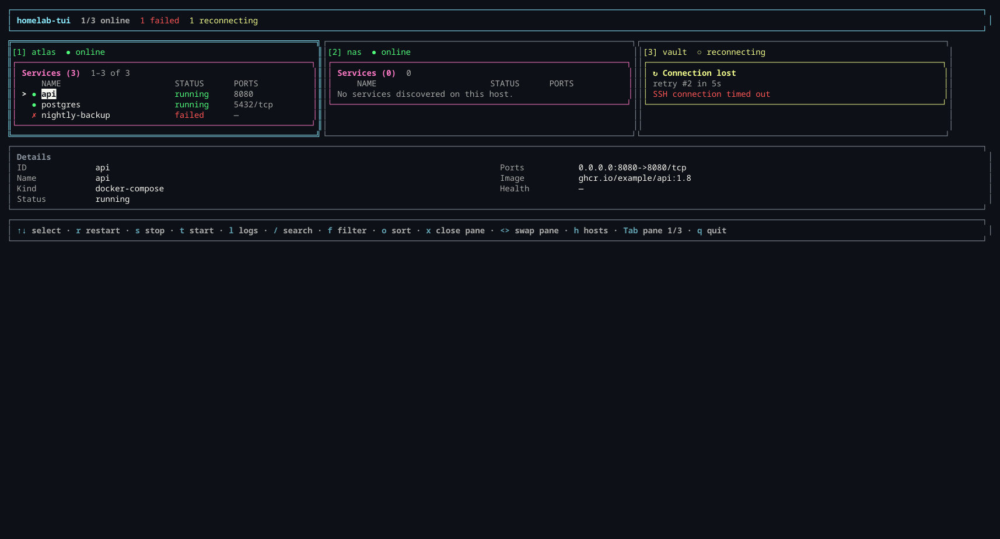

<p align="center">
  
</p>

<h1 align="center">homelab-tui</h1>

<p align="center">
  A fast, keyboard-first terminal interface for monitoring and controlling homelab hosts over SSH.
</p>

<p align="center">
  <a href="https://www.npmjs.com/package/homelab-tui"></a>
  <a href="https://www.npmjs.com/package/homelab-tui"></a>
  <a href="https://github.com/ACHRAF-YOUSSEF/homelab-tui/actions/workflows/docs.yml"></a>
  <a href="LICENSE"></a>
</p>

<p align="center">
  <a href="https://achraf-youssef.github.io/homelab-tui/">Documentation</a>
  ·
  <a href="https://github.com/ACHRAF-YOUSSEF/homelab-tui/releases">Releases</a>
  ·
  <a href="https://github.com/ACHRAF-YOUSSEF/homelab-tui/issues">Issues</a>
</p>



homelab-tui connects to Linux, macOS, and Windows hosts over SSH, discovers Docker containers and native services, displays system metrics and logs, and provides guarded service controls from one terminal.

## Features

- **Multi-host monitoring** — open several independent SSH connections in responsive panes.
- **Docker and Compose discovery** — inspect status, image, ports, health, and Compose projects.
- **Native service discovery** — find programs listening on TCP ports across supported operating systems.
- **System metrics** — monitor CPU, memory, and disk usage without installing a remote agent.
- **Live logs** — follow Docker logs and supported native-process logs over SSH.
- **Keyboard-first controls** — search, filter, sort, restart, stop, start, and switch panes without a mouse.
- **Resilient connections** — keep healthy hosts usable while another host reconnects or fails.
- **Secure authentication** — use passwords, private keys, encrypted keys, or an SSH agent.
- **Self-update support** — check for and install new GitHub releases from the CLI.

## Install

### npm

```sh
npm install -g homelab-tui
homelab-tui
```

The npm package installs the compiled binary for your operating system and CPU architecture. Bun is not required after installation.

### Bun

Bun requires packages with lifecycle scripts to be trusted:

```sh
bun add -g homelab-tui
bun pm trust homelab-tui
bun add -g homelab-tui
```

### Prebuilt binary

Download the latest binary from [GitHub Releases](https://github.com/ACHRAF-YOUSSEF/homelab-tui/releases).

| Platform | File |
|---|---|
| Linux x64 | `homelab-tui-linux-x64` |
| Linux arm64 | `homelab-tui-linux-arm64` |
| macOS Intel | `homelab-tui-darwin-x64` |
| macOS Apple Silicon | `homelab-tui-darwin-arm64` |
| Windows x64 | `homelab-tui-windows-x64.exe` |

### Build from source

```sh
git clone https://github.com/ACHRAF-YOUSSEF/homelab-tui.git
cd homelab-tui
bun install
bun run dev
```

## Quick start

Create `homelab.config.json`:

```json
{
  "hosts": [
    {
      "name": "server",
      "host": "192.168.1.10",
      "port": 22,
      "username": "admin",
      "authMethod": "key",
      "privateKeyPath": "~/.ssh/id_ed25519",
      "group": "home",
      "refreshInterval": 3000,
      "discovery": {
        "docker": true,
        "nativeServices": true,
        "includeStoppedContainers": true
      }
    }
  ]
}
```

Then launch:

```sh
homelab-tui
```

Passwords and private-key passphrases are prompted at launch and are never stored in the configuration file. See the [configuration guide](https://achraf-youssef.github.io/homelab-tui/guide/configuration) for every field and default.

## Usage

| Key | Action |
|---|---|
| `↑` / `↓` | Select a host or service |
| `Enter` | Connect or confirm |
| `Tab` / `Shift+Tab` | Focus the next or previous host pane |
| `/` | Search services |
| `f` | Cycle filters |
| `o` | Cycle sorting |
| `r` | Restart the selected service |
| `s` | Stop a container or kill a native process |
| `t` | Start a Docker container |
| `l` | Toggle live logs |
| `a` / `x` | Add or close a host pane |
| `h` | Return to the host selector |
| `q` | Quit |

The footer uses the same key definitions as the input handlers and adapts to the selected service. See the complete [keybinding reference](https://achraf-youssef.github.io/homelab-tui/guide/keybindings).

## Command line

| Option | Description |
|---|---|
| `--config <path>`, `-c <path>` | Use a configuration file for this run |
| `--set-config <path>` | Save the default configuration path |
| `--check-update` | Compare the installed and latest versions |
| `--update` | Download and install the latest release |
| `--version`, `-v` | Print the installed version |
| `--help`, `-h` | Print command help |

## Supported hosts

| Capability | Linux | macOS | Windows |
|---|:---:|:---:|:---:|
| System metrics | ✓ | ✓ | ✓ |
| Docker containers | ✓ | ✓ | ✓ |
| Native process discovery | ✓ | ✓ | ✓ |
| Native log streaming | `journalctl` | `log stream` | — |
| Native process restart | systemd | — | — |

Remote hosts need an SSH server and standard system utilities. Docker is only required for container discovery and controls. Windows hosts require [OpenSSH Server](https://learn.microsoft.com/windows-server/administration/openssh/openssh_install_firstuse).

## Documentation

- [Installation](https://achraf-youssef.github.io/homelab-tui/guide/install)
- [Configuration](https://achraf-youssef.github.io/homelab-tui/guide/configuration)
- [Monitoring](https://achraf-youssef.github.io/homelab-tui/guide/monitoring)
- [Keybindings](https://achraf-youssef.github.io/homelab-tui/guide/keybindings)
- [Command line](https://achraf-youssef.github.io/homelab-tui/guide/cli)
- [Troubleshooting](https://achraf-youssef.github.io/homelab-tui/guide/troubleshooting)

## Built With

- [Bun](https://bun.sh/) — runtime, package manager, test runner, and native binary compiler
- [TypeScript](https://www.typescriptlang.org/) — strict application code
- [React](https://react.dev/) — declarative interface components
- [Ink](https://github.com/vadimdemedes/ink) — React renderer for terminal interfaces
- [node-ssh](https://github.com/steelbrain/node-ssh) — SSH connections, commands, and log streams
- [Zod](https://zod.dev/) — configuration validation
- [VitePress](https://vitepress.dev/) — documentation site

## Development

```sh
bun install
bun run dev
bun test
bunx tsc --noEmit
bun run build:linux-x64
bun run docs:dev
```

Contributions are welcome. Please open an issue before a large behavioral change and run the relevant checks before submitting a pull request.

## License

homelab-tui is released under the [MIT License](LICENSE).

Copyright © 2026 [Achraf Youssef](https://github.com/ACHRAF-YOUSSEF).
