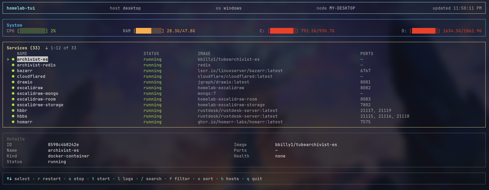
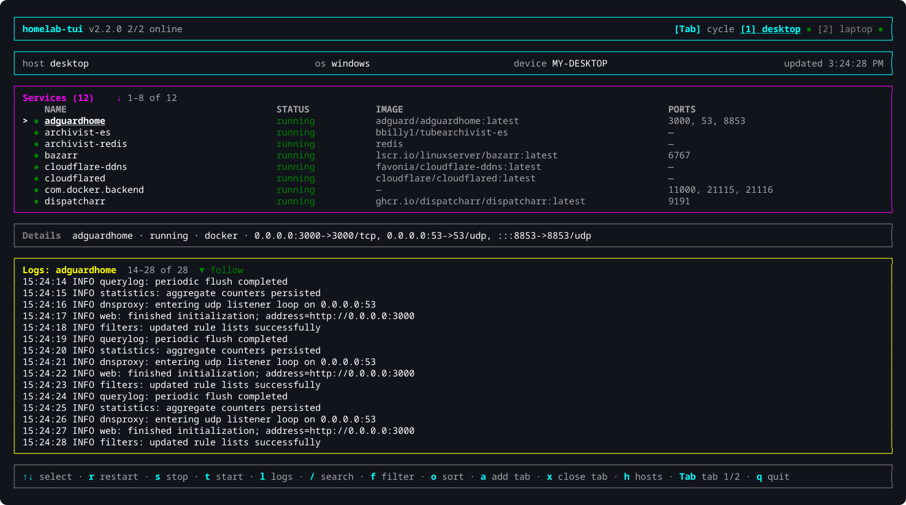
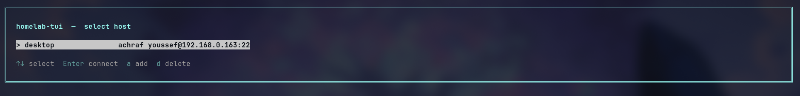
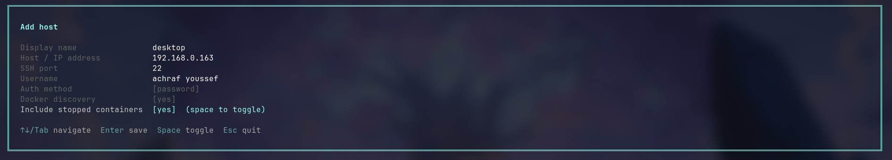

<div align="center">

# 🖥️ homelab-tui

**A cross-platform terminal UI for monitoring your homelab over SSH**

[](https://bun.sh)
[](https://www.typescriptlang.org/)
[](https://github.com/vadimdemedes/ink)
[](https://www.npmjs.com/package/homelab-tui)
[](LICENSE)

[]()
[]()
[]()

<p>
  <a href="https://github.com/ACHRAF-YOUSSEF">
    
  </a>
  <a href="https://achraf-youssef.github.io/portfolio/">
    
  </a>
</p>

> Discovers Docker containers and running programs (Jellyfin, Ollama, LM Studio, game servers…), streams live logs, and shows system metrics — all over SSH. Supports Linux, macOS, and Windows remote hosts.

</div>

---

## Screenshots

<table>
  <tr>
    <td></td>
    <td></td>
  </tr>
  <tr>
    <td><em>Service list with filter, sort and search</em></td>
    <td><em>Live log streaming</em></td>
  </tr>
  <tr>
    <td></td>
    <td></td>
  </tr>
  <tr>
    <td><em>Host selector</em></td>
    <td><em>Add host form</em></td>
  </tr>
</table>

## Installation

### npm / bun (recommended)

```sh
npm install -g homelab-tui
# or
bun add -g homelab-tui
```

The correct binary for your platform is downloaded automatically. No Bun runtime needed after install.

### Download a binary manually

Download the latest binary for your platform from [Releases](https://github.com/ACHRAF-YOUSSEF/homelab-tui/releases):

| Platform | File |
|---|---|
| Linux x64 | `homelab-tui-linux-x64` |
| Linux arm64 | `homelab-tui-linux-arm64` |
| macOS x64 | `homelab-tui-darwin-x64` |
| macOS arm64 (M-series) | `homelab-tui-darwin-arm64` |
| Windows x64 | `homelab-tui-windows-x64.exe` |

```sh
chmod +x homelab-tui-linux-x64
mv homelab-tui-linux-x64 /usr/local/bin/homelab-tui
```

### From source (requires Bun)

```sh
git clone https://github.com/ACHRAF-YOUSSEF/homelab-tui
cd homelab-tui
bun install
bun dev
```

## Requirements

- SSH access to remote host (password or private key)
- Docker installed on remote host (for container discovery)

## CLI

```sh
homelab-tui                                    # launch TUI
homelab-tui --config /path/to/homelab.config.json  # use a specific config (session only)
homelab-tui --set-config /path/to/homelab.config.json  # persist config path as default
homelab-tui --update                           # self-update to latest GitHub release
homelab-tui --check-update                     # check latest version without installing
homelab-tui --version                          # print version
homelab-tui --help                             # print help
```

On first launch with no config file, a setup screen lets you create one or point to an existing path.

## Config

```json
{
  "hosts": [
    {
      "name": "desktop",
      "host": "192.168.1.20",
      "port": 22,
      "username": "achraf",
      "authMethod": "password",
      "discovery": {
        "docker": true,
        "nativeServices": false,
        "includeStoppedContainers": true
      }
    }
  ]
}
```

| Field | Description |
|---|---|
| `authMethod` | `"password"` (prompted at launch) or `"key"` (SSH private key, supports agent) |
| `privateKeyPath` | Required when `authMethod` is `"key"` |
| `nativeServices` | Discover processes listening on TCP ports (Jellyfin, Ollama, LM Studio, game servers…) |
| `includeStoppedContainers` | Show stopped Docker containers |

## Screens

### Host selector
Shown on startup. Lists all configured hosts.

| Key | Action |
|-----|--------|
| `↑` / `↓` | Select host |
| `Enter` | Connect |
| `a` | Add new host |
| `e` | Edit selected host |
| `d` | Delete selected host |

### Add / Edit host form

| Key | Action |
|-----|--------|
| `↑` / `↓` / `Tab` | Navigate fields (wraps) |
| `Space` | Toggle boolean / auth method |
| `Enter` | Confirm field / save |
| `Esc` | Cancel (or quit on first run) |

### Monitor

| Key | Action |
|-----|--------|
| `↑` / `↓` | Select service |
| `r` | Restart selected Docker container |
| `s` | Stop selected Docker container / kill selected process |
| `t` | Start selected Docker container |
| `l` | Toggle live log panel |
| `↑` / `↓` / `PgUp` / `PgDn` | Scroll log panel (when open) |
| `/` | Search by name or image |
| `f` | Cycle filter: all → docker → processes → running → stopped → failed → restarting |
| `o` | Cycle sort: name → status → image |
| `h` | Back to host selector |
| `q` | Quit |

> The footer hints update based on what is selected: Docker containers show `r restart · s stop · t start`, discovered processes show only `s kill`.


## Features

- **Multi-host** — add, edit, delete hosts at runtime; config auto-saved
- **OS detection** — auto-detects Linux, macOS, Windows over SSH
- **Docker discovery** — containers with status, image, ports, health, Compose project
- **Process discovery** — finds programs listening on TCP ports (Jellyfin, Ollama, LM Studio, game servers, etc.) on Linux, macOS, and Windows
- **Live logs** — `docker logs -f` streamed over SSH, scrollable with auto-follow
- **System metrics** — CPU %, RAM, disk usage with progress bars
- **Search / filter / sort** — filter by type (docker/processes) or status, sort by name/status/image
- **Context-aware controls** — Docker: restart/stop/start; discovered processes: kill only
- **Auto-reconnect** — exponential backoff (3 → 5 → 10 → 20 → 30 s) when SSH drops
- **Password & key auth** — password prompted securely; SSH agent supported for encrypted keys
- **Self-update** — `homelab-tui --update` downloads and replaces the binary in place with a live progress bar
- **Update notifications** — checks for a new release on launch and shows a badge in the header if one is available

## Enabling OpenSSH on Windows (remote host)

Open PowerShell as Administrator:

```powershell
Add-WindowsCapability -Online -Name OpenSSH.Server~~~~0.0.1.0
Start-Service sshd
Set-Service -Name sshd -StartupType Automatic

$authorizedKeysPath = "$env:USERPROFILE\.ssh\authorized_keys"
New-Item -Force -ItemType Directory (Split-Path $authorizedKeysPath)
Add-Content $authorizedKeysPath "ssh-ed25519 AAAA... your-public-key"
```

## Releasing a new version

```sh
bun run release:patch   # 1.0.0 → 1.0.1
bun run release:minor   # 1.0.0 → 1.1.0
bun run release:major   # 1.0.0 → 2.0.0
```

Pushes a git tag → GitHub Actions builds all 5 platform binaries → creates GitHub release → publishes to npm.

## Header

The top bar always shows the app version (`v1.0.1`). If a newer release is available it shows `↑ v1.0.2 available` in yellow next to the version. Run `homelab-tui --update` to install it.

## Known Limitations

- Only one host monitored at a time (no split-pane multi-host view)
- Discovered processes have no log streaming (logs are application-specific)
- Discovered processes cannot be restarted or started (only killed)
- CPU usage on Linux requires two `/proc/stat` reads 200 ms apart

## Star History

<a href="https://www.star-history.com/?repos=ACHRAF-YOUSSEF%2Fhomelab-tui&type=timeline&legend=top-left">
    <picture>
        <source media="(prefers-color-scheme: dark)" srcset="https://api.star-history.com/chart?repos=ACHRAF-YOUSSEF/homelab-tui&type=timeline&theme=dark&legend=top-left" />
        <source media="(prefers-color-scheme: light)" srcset="https://api.star-history.com/chart?repos=ACHRAF-YOUSSEF/homelab-tui&type=timeline&legend=top-left" />
        
    </picture>
</a>
